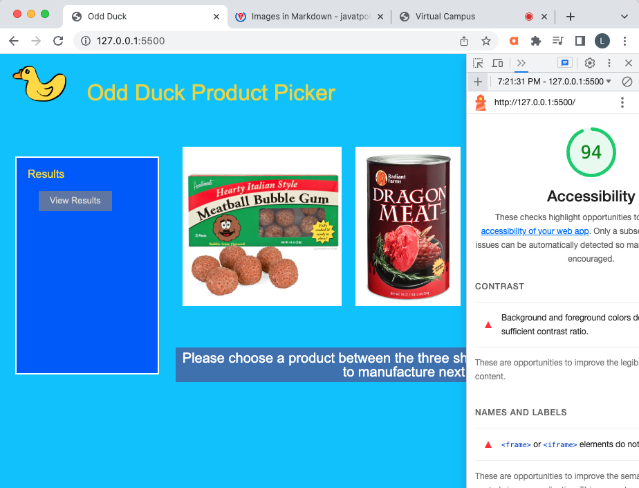
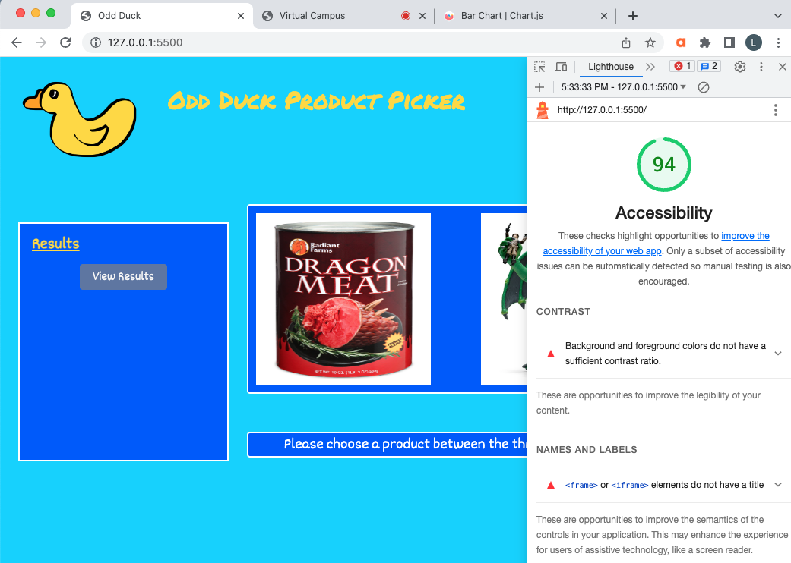
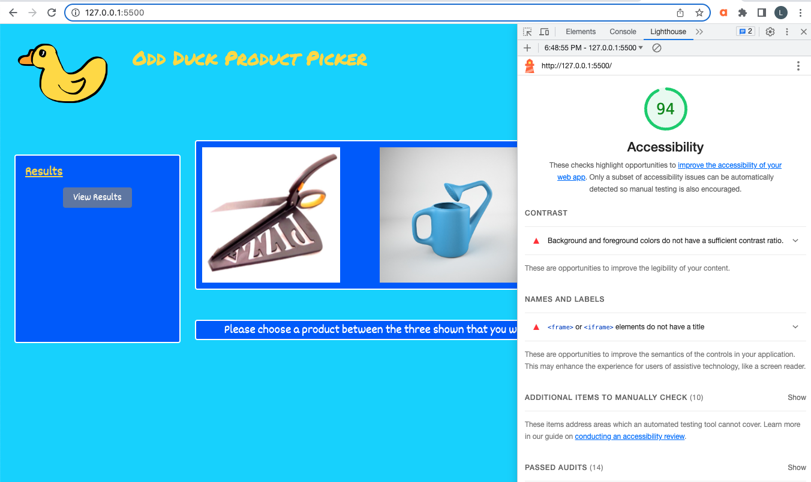

# odd-duck

Lab 11 - 15b

## Lighthouse Reports

## Overview

This app is a product picker for Odd Ducks Inc. Each employee at Odd Ducks will walk into work and pick the product they want to see manufactured next. After 25 employees have picked their preferred product, the marketing team will be able to view the results on a list and a table that will include the number of view and number of votes of each product. The next day, the marketing team can refresh the app and it will save the votes and views from the previous day, while allowing for another 25 rounds of voting.
